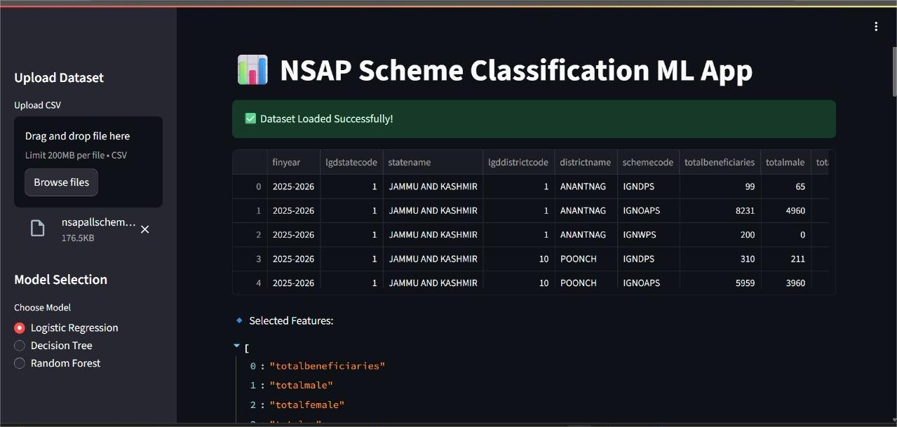

# Predicting Social Welfare Scheme Eligibility with Machine Learning

## 📝 Problem Statement

This project focuses on developing a multi-class classification model to predict eligibility for social welfare schemes under the **National Social Assistance Program (NSAP)**, a program by the Government of India. The goal is to create a reliable and efficient tool to assist government agencies in accurately and quickly assigning the most appropriate scheme to applicants based on their demographic and socioeconomic data.

Manually verifying applications can be time-consuming and prone to errors. An inaccurate or delayed allocation can prevent deserving individuals from receiving timely financial aid. This project aims to solve this challenge by automating the classification process using machine learning.

## 🚀 The Solution

A machine learning pipeline was designed and implemented to address the problem, with the following key components:

1.  **Data Preparation**: The provided dataset `nsapallschemes.csv` was used, which contains various demographic and socioeconomic indicators. The data was cleaned and preprocessed to be suitable for machine learning models.
2.  **Model Building**: Multiple multi-class classification algorithms were explored, including **Logistic Regression**, **Decision Tree**, and **Random Forest**, to identify the best-performing model for predicting the `schemecode` (the specific welfare scheme).
3.  **Model Evaluation**: The models were evaluated using key metrics such as Accuracy, Precision, Recall, and F1-Score, along with a Confusion Matrix, to ensure the model's reliability and performance.
4.  **Deployment**: The best-performing model was deployed to a web-based application using **Streamlit** for a user-friendly interface. This allows government agencies to input applicant details and receive an instant prediction of the most suitable scheme.

## 🎥 Demo

A short video demonstrating the application's functionality is included in the repository.

  * `https://drive.google.com/file/d/1Zh0Cu-DSTvvM2B_0QsYCpjcwJlvzBIVX/view?usp=drive_link`

## Demo as picture:
[]

## ⚙️ Technology Stack

  * **Python**: The core programming language for the project.
  * **Pandas & NumPy**: For data manipulation and numerical operations.
  * **Scikit-learn**: For building and evaluating the machine learning models.
  * **Streamlit**: For creating the interactive web application frontend.
  * **Google Colab**: The development environment used for writing and running the Python code.
  * **IBM Cloud Lite Services**: The project was developed with a focus on being compatible with IBM Cloud Lite services, as specified in the problem statement.

## 📁 Project Structure

The repository is structured as follows:

```
.
├── nsapallschemes.csv           
├── Predicting_Eligibility_for_Social_Welfare_Schemes_using_Machine _Learning.ipynb
├── LICENSE
└── README.md                     
```

## 📋 Getting Started

Follow these instructions to get a copy of the project up and running on your local machine for development and testing purposes.

### Prerequisites

You'll need to have Python and pip installed.

### Installation

1.  Clone the repository:
    ```bash
    git clone <repository_url>
    cd <repository_name>
    ```
2.  Install the required libraries:
    ```bash
    pip install -r requirements.txt
    ```
    *(Note: You'll need to create a `requirements.txt` file based on the libraries used in the project, such as `pandas`, `scikit-learn`, and `streamlit`.)*

### Running the Application

To run the Streamlit application locally, execute the following command:

```bash
streamlit run app.py
```

This will start a local web server and open the application in your default web browser.

## 📈 Model Performance

The performance of the models was thoroughly evaluated. The `Random Forest` model generally provided the highest accuracy.

### Evaluation Metrics (Example from Logistic Regression)

  * **Test Accuracy**: 0.9592
  * **CV Accuracy**: 0.9694

A detailed classification report and confusion matrix are available in the project files to provide a deeper insight into the model's performance on a per-class basis.

## 🤝 Contribution

Contributions are welcome\! If you have suggestions for improvements or new features, please feel free to open an issue or submit a pull request.
